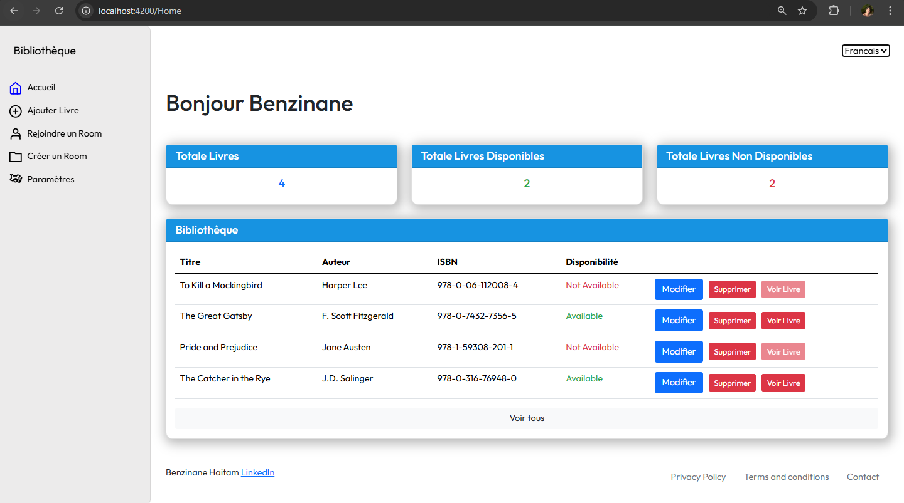

# BiblioConnect - Sockets

Système de gestion intelligente de bibliothèque et création de salles qui utilise la technologie des sockets en temps réel pour des expériences de lecture collaboratives, permettant aux utilisateurs de créer et de rejoindre des salles virtuelles pour lire le même livre ensemble tout en discutant.

Le projet n'est pas encore terminé

